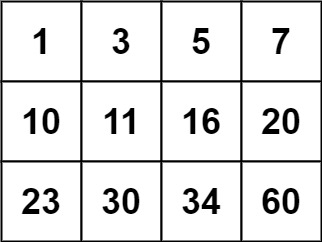

# 74. Search a 2D Matrix

## Description
Write an efficient algorithm that searches for a value `target` in an `m x n` integer matrix `matrix`.
This matrix has the following properties:
- Integers in each row are sorted from left to right.
- The first integer of each row is greater than the last integer of the previous row.

## Example 1:

<pre>
<b>Input:</b> matrix = [[1,3,5,7],[10,11,16,20],[23,30,34,60]], target = 3
<b>Output:</b> true
</pre>

## Example 2:

<pre>
<b>Input:</b> [[1,3,5,7],[10,11,16,20],[23,30,34,60]], target = 13
<b>Output:</b> false
</pre>

## Constraints
- $m == matrix.length$
- $n == matrix[i].length$
- $1 <= m, n <= 100$
- $-10^4 <= matrix[i][j], target <= 10^4$

---

## Thoughts:
1. Because the sorted matrix has `the first integer of each row is greater than last integer of the previous row` property. So we can imagine the matrix is expanded as an **one-dimensional array**.
2. After that, it can be treated as an **one-dimensional array** to do the simple **binary search**.
3. Just use the `middle` as the index of the **one dimensional array**, and we can access the corresponding element in the **matrix** with the `column` size(total number of one row) calculation.
4. The following formula for calculating the **nth** element position in the matrix:
    - **row**: n / total number of one row
    - **column**: n % total number of one row

## Languages:
- C: [SearchMatrix.c](SearchMatrix.c)
- Java: [SearchMatrix.java](SearchMatrix.java)
- Swift: [SearchMatrix.swift](SearchMatrix.swift)
